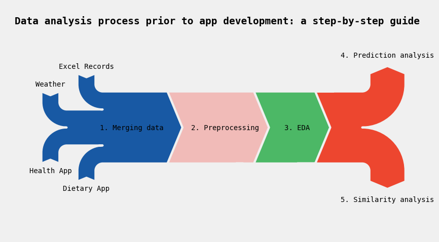
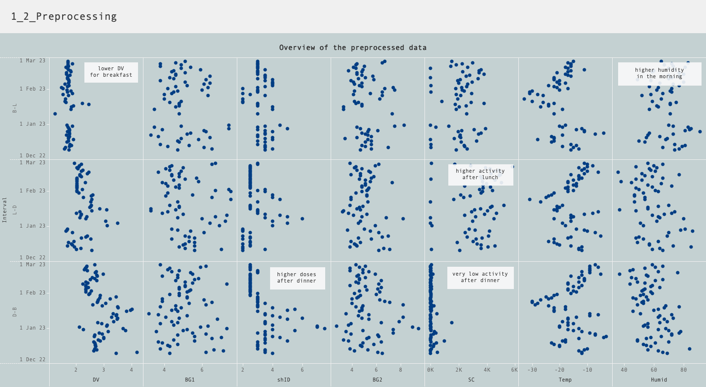
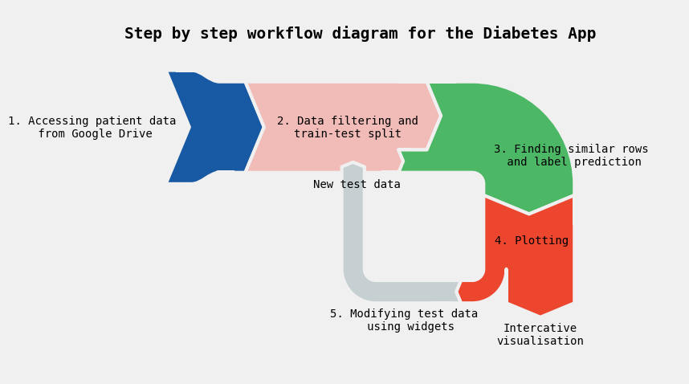
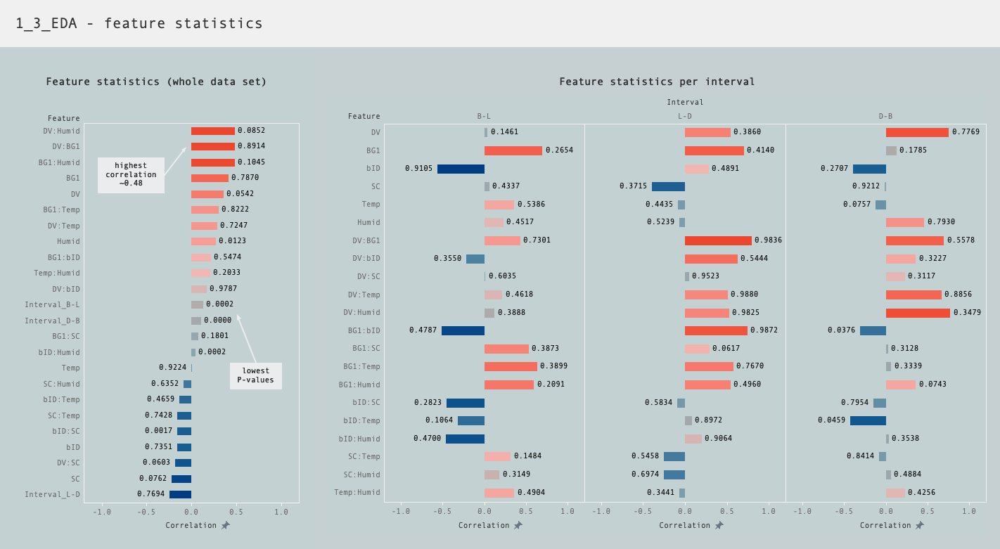

# DIABETES APP: AI-Based System for Personalized Insulin Dose Recommendations: Integrating External Factors for Enhanced Accuracy in Type 1 Diabetes Management
## ABSTRACT
This project seeks to develop an AI-based system that will provide personalized short-acting insulin dose recommendations before meals to individuals living with type 1 diabetes, empowering them to better manage their condition. The system will use data collected from individuals in a structured format to accurately predict the most appropriate insulin doses based on their individual factors, including external factors such as weather or physical activity, providing an alternative to the traditional calculation method.
## QUESTION
Can an AI-based system provide more accurate insulin dose recommendations than existing methods of insulin dose prediction?
## HYPOTHESIS
An AI-based system will provide more accurate and personalized insulin dose recommendations than existing methods of insulin dose prediction due to its ability to incorporate a diverse range of external factors that influence insulin sensitivity.
## BACKGROUND
The background research examines the global distribution of type 1 diabetes and investigates the conventional approach for calculating insulin dosage. 
According to the International Diabetes Federation (IDF), around 10% of all people with diabetes have type 1 diabetes and  the total number of people living with diabetes is projected to rise to 643 million by 2030 and 783 million by 2045 [1]. The analysis of the data presented in the IDF's 2022 report [2] reveals the highest prevalence rates in specific regions, namely Northern Europe (Finland, Sweden, Norway), Canada, and Gulf states (Saudi Arabia, Qatar, and Kuwait). 
Countless individuals with diabetes type 1 struggle with accurately predicting insulin doses. The traditional calculation includes two parts: high blood glucose correction + carbohydrate coverage [3], but other factors affecting insulin sensitivity are not taken into account  [4]. The visualization of the factors showcases both the existing factors that are currently considered and the numerous untapped factors that could enhance the accuracy of insulin dosage calculations. This project specifically focuses on a few factors that are easily collectible and quantifiable.

_Tools used: data preprocessing and analysis in Python ([view notebook1](0_BackgroundResearch_1.ipynb), [view notebook2](0_BackgroundResearch_2.ipynb)) + data storage in PostgreSQL + visualization in Tableau [(view dashboard)](https://public.tableau.com/views/DiabetesApp_0_BackgroundResearch/0_Backgroundresearch?:language=en-US&:display_count=n&:origin=viz_share_link)._

## DATA
Data from one patient was collected to create a core concept for the AI system: pre-meal blood glucose, carb intake, injected insulin doses (manual Excel & dietary app); physical activity (Health App/Apple Watch); and weather records (VisualCrossing.com).
## PROCEDURE
The project consisted of the following steps:
### 1. DATA ANALYSIS
The analysis involves merging, preprocessing, and performing descriptive and predictive analysis on the collected data.

_Tools used: Matplotlib sankey diagram in Python [(view notebook)](ProcessSankeys.ipynb)_

#### 1_1_Data merging
Collected data from diverse sources were consolidated into a single dataset. The visualization shows a well-distributed pattern of data over time, with higher density in the Health App and weather data. This is because the patient-collected data is recorded only before meals, while other data points are recorded more frequently.

_Tools used: data manipulation in Python [(view notebook)](1_1_Merging.ipynb) + visualization in Tableau [(view dashboard)](https://public.tableau.com/views/DiabetesApp_1_1_Merging/1_1_Merging?:language=en-US&:display_count=n&:origin=viz_share_link)._

#### 1_2_Data preprocessing
The data set was initially sorted chronologically by date. To address missing values, interpolation was applied to Temp and Humid variables, while SC values were summed for each meal interval. Subsequently, the dataset was structured to ensure consistency and facilitate further analysis. Additionally, outlier detection was conducted through a combination of manual inspection and the implementation of the DBSCAN clustering technique.

_Tools used: data manipulation in Python [(view notebook)](1_2_Preprocessing.ipynb) + data storage in PostgreSQL + visualization in Tableau  [(view dashboard)](https://public.tableau.com/views/DiabetesApp_1_2_Preprocessing/1_2_Preprocessing?:language=en-US&:display_count=n&:origin=viz_share_link)._

#### 1_3_Exploratory data analysis
Relationships between features and the target labels were investigated, leading to the selection of essential features for machine learning tasks. This analysis explored two target labels: the required insulin dose (shID), which is contingent upon various internal and external factors, and the after-meal blood glucose level (BG2), which is a result of the insulin dose decision.
The correlation and statistical significance of features were calculated, highlighting the significance of certain variables. The distribution of shID within intervals showed different patterns.
Further investigation focused on the correlation of features within each interval, revealing distinct tendencies. Features were explored individually as well as in interaction with others. 
Regarding BG2, the relationship with ((BG1-targetBG)+DV)/shID was investigated, showing varying insulin sensitivity across intervals. This formula, which describes the decision made on shID or insulin sensitivity, assesses the ratio of the difference between the pre-meal blood glucose level (BG1) and the target blood glucose level, augmented by the dietary value (DV), divided by the delivered insulin dose (shID). A lower ratio indicates a lower shID required, while a higher ratio suggests a higher insulin dose. 
Importantly, the analysis demonstrated different patterns across intervals and the influence of external factors on the required insulin dose. This formed the basis for interval-specific prediction tasks, incorporating a broader range of features than the traditional calculations of pre-meal glucose level (BG1) and dietary value (DV) alone.

_Tools used: data exploration in Python ([view notebook1](1_3_EDA_shID.ipynb) and [notebook2](1_3_EDA_BG2.ipynb) + visualization in Tableau  ([view dashboard1](https://public.tableau.com/views/DiabetesApp_1_3_EDA/1_3_EDA1?:language=en-US&publish=yes&:display_count=n&:origin=viz_share_link) and [dashboard2](https://public.tableau.com/views/DiabetesApp_1_3_EDA/1_3_EDA2?:language=en-US&:display_count=n&:origin=viz_share_link))._

#### 1_4_Prediction analysis
Multiple prediction algorithms were evaluated before choosing the most suitable one for the application. In the prediction of shID, both regression and classification methods were employed. The RandomForest algorithms yielded the best performance for both tasks. However, the classification approach posed challenges due to the manual analysis required for class definitions, making it less suitable for real-life applications. Consequently, the regression method was selected for future implementation, allowing for accurate predictions of both shID and BG2.

_Tools used: data predictive analysis in Python ([view notebook](1_4_Prediction.ipynb))_

#### 1_5_Similarity analysis
Extracting similar situations from the past enhances comprehension of each pre-meal scenario. This section of the project aims to identify a method for finding rows in a given data frame that are similar to the input data. The objective is to create a visualization that demonstrates how patients responded to similar internal and external factors and determine the required insulin dose to achieve normal after-meal glucose levels.

_Tools used: data analysis in Python ([view notebook](1_5_Similarity.ipynb))_

### 2. APP DEVELOPMENT
This section aims to develop an interactive data application that retrieves patient records from Google Drive, processes them, and generates an interactive visualization. The app compares past similar situations with the input data and provides suggestions for the short-acting insulin dose (shID) and predicts the resulting post-meal glucose level (BG2).

_Tools used: Matplotlib sankey diagram in Python ([view notebook](ProcessSankeys.ipynb))_

## RESULTS
The resulting AI-system is an app that follows a logical, intuitive, and user-friendly approach:

- The app retrieves data from a Google Drive database. 
- The data is filtered and divided into a train set and a test set, with the last row serving as the test set and the remaining data used for training purposes.
- The app identifies the four most similar rows in the train set to the test set.
- Simultaneously, the train set is utilized to train a RandomForestRegression model, which is subsequently employed to predict the shID and BG2 values.
- To provide a comprehensive comparison, the app visualizes the similar rows alongside the test row, incorporating the predicted missing values (shID and BG2).
- The test data can be modified using the widgets, allowing for interactive adjustments and dynamically updating the visualization.

_Tools used: Data analysis and dashboarding in Python ([view notebook](2_App.ipynb)) + deployment through MyBinder ([try the app](https://mybinder.org/v2/gh/vivelafefe/diabetes.git/HEAD?urlpath=/panel/2_App))_

## CONCLUSION
Through the application of modern data analysis this research demonstrates the substantial impact of external factors on insulin sensitivity. By leveraging machine learning techniques, insulin prediction was significantly improved, leading to more accurate results. Furthermore, an automated tool was successfully developed, enabling efficient and accurate analysis of patient data and facilitating informed decision-making regarding insulin dosing before meals. Further analysis is needed before the widespread implementation of this tool, as the research only examined data from a single individual. Expanding the study to a larger and more diverse dataset is necessary to validate its effectiveness across a broader population with type 1 diabetes.

#### References:
1. Diabetes Facts & Figures (2021). International Diabetes Foundation. https://idf.org/aboutdiabetes/what-is-diabetes/facts-figures.html
2. IDF’s report 2022. Diabetes Atlas. https://diabetesatlas.org/idfawp/resource-files/2022/12/IDF-T1D-Index-Report.pdf
3. Calculating insulin dose. Diabetes Edication Online: Diabetes Teaching Center at the University of California, San Francisco https://dtc.ucsf.edu/types-of-diabetes/type1/treatment-of-type-1-diabetes/medications-and-therapies/type-1-insulin-therapy/calculating-insulin-dose/
4. Adam Brown. 42 Factors that affect blood glucose (October 2019).DiaTribeLearn https://diatribe.org/

